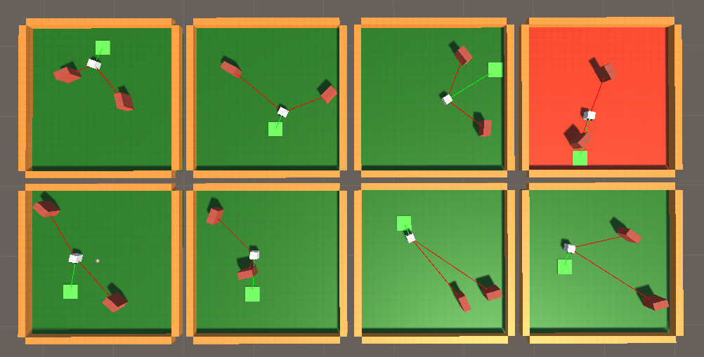

# IML_Project_RL

Ce projet a été réalisé dans le cadre du modules IML du Master SIIA de l'UBO. Ce projet a été réalisé par MODENA Enzo et GEORGES Benjamin.

Ce projet & été créé sur Unity 2021.3.9f1 (LTS) avec le package mlagents version 2.0.1

## Table des matières

- [Objectif de ce projet](#objectif-de-ce-projet)
- [Description des Environnements virtuels créés](#description-des-Environnements-virtuels-créés)
- [Description de l'entrainement de l'IA](#description-de-l'entrainement-de_l'IA)
  - [Environnement d'entrainement](#environnement-d'entrainement)
  - [Arène 1](#arène-1)
  - [Arène 2, Version 1](#arène-2-version-1)
  - [Conclusion](#conclusion)
- [Challenges](#challenges)
- [Améliorations futures](#améliorations-futures)
- [Démonstration](#démonstration)

## Objectif de ce projet

L'objectif de ce projet est de train une IA qui contrôlera un robot pour aller jusqu'à un objectif qui sera placer de façon aléatoire sur une carte avec des obstacles. A chaque fois que le robot arrivera sur l'objectif, l'environnement changera pour en recréer un nouveau où le robot devra retourner sur l'objectif.

## Description des Environnements virtuels créés

Pour gérer l'environnement nous avons conçu plusieurs scripts : 
- AreneManager
  - Fonctionnalités :
    - resetRun() -> Permet de gérer le positionnement de l'agent et de l'objectif sur une map de taille petite
    - SuccesTask() -> Retour utilisateur pour voir l'évolution de l'entraînement
    - FailedTask() -> Retour utilisateur pour voir l'évolution de l'entraînement
- AreneManagerAdvanced hérite de AreneManager :
  - Fonctionnalités :
    - resetRun() -> Redéfini resetRun afin qu'elle soit efficace sur des environnements de taille grande avec des obstacles
    - initRun() -> Permet de gérer l'initialisation des entraînements afin de choisir le type d'aléatoires (Plusieurs map différentes, Un même type de map,...) ce qui permet d'entraîner notre agent de manière poussée sur différents schémas d'apprentissage
    - Update() -> Retour utilisateur pour voir ce qui influence les décisions de l'agent (Raycast ...)
    - generatedObsFromSave() -> Génération des obstacles de manière aléatoire.
    - checkDistance() -> Règles pour la génération des obstacles...
    - subscribeOBS() -> Permet de copier la structure d'une map sur d'autres maps afin d'accélérer l'entraînement

Ces scripts permettent toutes la gestion de la création de l'environnement aléatoirement ce qui est très important dans le processus d'entraînement d'un agent de manière efficace afin d'éviter l'overfitting sur un seul et même environnement. Ils permettent aussi de visualiser l'agent entraîner sur des maps choisies afin de voir si l'entraînement à été efficace et si l'agent RL réussi bien les tâches.

## Description de l'entrainement de l'IA

Pour ce projet nous avons choisi de faire une IA d'apprentissage par renforcement qui a pour but d'atteindre l'objectif qui est placé dans l'arène. A chaque arène nous allons décrire comment nous allons positionner les rewards qui sont essentiels pour ce type d'IA

### Environnement d'entrainement

Avant d'entrainer notre IA nous devions créer l'environnement pour l'entrainer nous vous référons au fichier **Train_RL.md**

### Arène 1

Une fois l'environnement créer nous avons commencé l'entrainement sur l'arène 1. Cela nous a permis de comprendre comment entrainer une IA et de savoir comment la modifier. 

#### Description de l'arène 1 

L'arène 1 est une petite arène entourée de mur. Le Robot que l'IA contrôle ainsi que l'objectif sont placé de façon aléatoire à chaque fin d'époque. 

En ce qui concerne les rewards, nous avons mis une reward positif pour l'objectif et une rewrad négative sur les murs.

#### Entrainement de l'IA

Pour entrainer plus rapidement notre IA nous créé 16 fois l'arène pour nous permettre de gagner du temps sur le training qui durait plusieurs minutes voir dizaines de minutes.

Nous avons commencé à comprendre les différents paramètres du fichier *.yaml* qui correspond à tous les paramètres pour l'environnement d'entrainement et de l'IA.

Voici le lien vers la documentation du fichier *.yaml* : https://github.com/Unity-Technologies/ml-agents/blob/com.unity.ml-agents_2.0.1/docs/Training-Configuration-File.md

### Arène 2 Version 1

Suite à l'entrainement sur l'arène 1 qui nous a permis de comprendre comment on entrainer une IA avec mlagents, nous sommes passées à la seconde arène qui est plus grande et avec des obstacles.

#### Description de l'arène 2

L'arène 2 est une arène qui est 4 fois plus grande que l'arène 1. Celle-ci de la même façon que l'arène 1, positionne le robot et l'objectif de façon aléatoire. L'ajout principal de cette arène est la présence d'obstacles qui apparaissent de façon aléatoire en même temps que l'objectif et le robot. Nous contrôlons le nombre d'obstacles qui apparaissent à chaque fois.

En ce qui concerne les rewards : 
- objectif : reward positive (1)
- rapprochement entre le robot et l'objectif : reward positive (1/distance  * 0.0001)
- murs : reward négative (-1)
- obstacles : reward négative (-2)

L'autre changement est cette reward positive qui correspond au rapprochement entre le robot et l'objectif, c'est à dire que plus le robot est proche de l'objectif plus sa reward augmente. Cela permettra au robot de se rapprocher plus rapidement de l'objectif.

#### Entrainement de l'IA 

Pour entrainer plus rapidement notre IA nous créé 8 fois l'arène pour nous permettre de gagner du temps sur le training qui durait plusieurs minutes voire dizaines de minutes.

Pour commencer nous avons entrainer l'IA sur l'arène sans obstacles. L'IA a rapidement réussi à trouver l'objectif comme sur l'arène 1.

Nous avons enchainé sur un entrainement avec 2 obstacles. C'est à partir de ce moment où nous avons dû réellement changer les paramètres de l'IA pour qu'elle puisse atteindre de façon correcte l'objectif. Nous avons fait une quinzaine d’entrainement différents toutes les informations de ses tests sont marqué sous forme de notes dans le fichier **Config\test_training_arene2.md**. Dans ce fichier vous pourrez trouver tous ce que nous avons modifier à chaque entrainement.

Lorsque nous avions trouvé quelques choses de correct, nous sommes passé à 5 obstacles. Cependant nous sommes assez rapidement arrivés à la conclusion que l'IA n’arrivera pas à résoudre ce problème. 

Nous avons donc choisi de créer une nouvelle version de cette arène.

### Arène 2, Version 2

Suite aux problèmes de complexité que la version 1 posait nous avons choisi de créer une seconde version de cette arène.

#### Description de la version 2

Nous allons ici énumérer seulement les changements avec la version 1.

Le problème des obstacles : Suite à la trop grande complexité engendrée par le fait que les obstacles soit recréé à chaque fin d'époques nous avons choisi de créer les obstacles au début de l'entrainement et de ne plus les changer. Seul le robot et l'objectif pourrait changer de place à la fin d'une époque. De plus vu que nous créons plusieurs arènes pour entrainer l'IA nous allons pouvoir faire que toutes les arènes soient avec des obstacles différents ou tous les obstacles au même emplacement.

Le problème de la reward positif au rapprochement entre le robot et l’objectif : Cette reward permettait au robot d'aller rapidement proche de l'objectif. Cependant le robot préférait rester proche de l'objectif qu'aller sur l'objectif. Nous avons donc changé ça pour mettre une reward négative qui décroit en fonction de la distance avec l'objectif. Nous pensons qu'avec ce changement l'IA préfèrera aller directement sur l'objectif. Cette reward est maintenant de (- distance *0.001)

#### Entrainement de l'IA 

Encore une fois nous avons créé 12 arènes pour entrainer plus rapidement notre IA.

Nous avons donc créé les arènes avec 5 obstacles qui était aléatoire sur chacune des arènes. Nous avons effectué quelques tests sur cette arène, vous pourrez retrouver toutes nos notes sur ces tests dans le fichier **Config\test_training_arene2_v2.md**. 

Grace aux tests précédemment réalisés nous avons réussi à trouver une IA très correcte rapidement. 

### Conclusion

L'IA que nous avons entrainer permet d'aller à l'objectif quasiment à chaque fois. 

## Challenges
Nous avons rencontré plusieurs challenges lors de ce projet :

- La création de l'environnement aléatoire : En effet, la mise en place de l'algorithme permettant de créer un environnement généré aléatoirement soumis à plusieurs règles (distance minimum entre les obstacles, avec le joueur, entre l'objectif et le joueur, le fait que l'environnement puisse se détruire et se reconstruire de manière fluide et rapide pendant l'entraînement...) a pris beaucoup de temps et a nécessité plusieurs phases de test afin de le perfectionner et de le valider.
- Le choix et la gestion des données à suivre en entrée de notre réseau de neurones (position des obstacles vs système de raycast pour détecter les obstacles...)
- La paramétrisation des hyperparamètres de l'IA a été un long travail de test durant ce projet. Dans un premier temps grâce à la documentation nous avons pu comprendre les différents paramètres de l'IA. Ensuite nous avons du utiliser les connaissances ainsi acquises pour les appliquer à notre projet. 

## Améliorations futures
Nous avons plusieurs points d'amélioration pour le futur :

- Unity : améliorer l'apparition des objectifs pour qu'ils n'apparaissent plus dans un obstacle ce qui rends plus difficile l'entrainement
- Paramétrisation du fichier *.yaml*: Il y a 2 points d'amélioration lié au fichier *.yaml*:
    - Paramétrisation de l'IA : Dans ce projet nous ne nous sommes concentrés uniquement sur l'entraineur PPO, qui est celui par défaut, mais il y a aussi d'autre entraineur que nous n'avons pas tester tel que SAC et POCA
    - Paramétrisation de l'environnement : Nous pouvons aussi modifier directement dans le fichier *.yaml* l'environnement d'entrainement que nous voulons pour ne pas rendre le projet encore plus difficile nous avons choisi de ne pas toucher à ces paramètres.

## Démonstration

### Agent non entrainé sur petite map sans obstacles

### Agent entrainé sur petite map sans obstacles

### Agent non entrainé sur grande map avec obstacles aléatoire

### Agent entrainé sur grande map avec obstacles aléatoire

### Vidéo de démo Agent entrainé sur grande map avec obstacles aléatoire
https://youtu.be/fh3hQhvej6E
